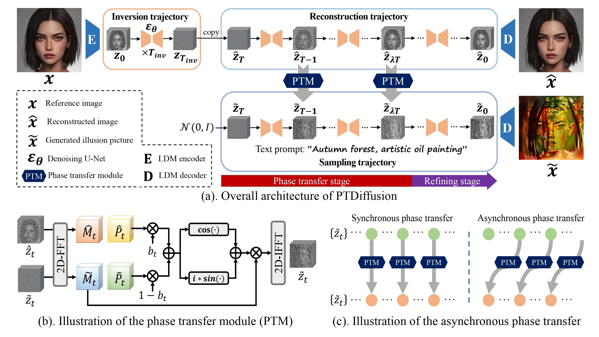

# 
PTDiffusion: Free Lunch for Generating Optical Illusion Hidden Pictures with Phase-Transferred Diffusion Model

[CVPR 2025] Official code of the paper "PTDiffusion: Free Lunch for Generating Optical Illusion Hidden Pictures with Phase-Transferred Diffusion Model". [Paper link](https://arxiv.org/abs/2503.06186)

Taking the first image on the left as an example, what do you see at your first glance? A painting of a path through a forest (zoom
in for a detailed look), or a human face (zoom out for a more global view)? Based on the off-the-shelf text-to-image diffusion model,
we contribute a plug-and-play method that naturally dissolves a reference image (shown in the bottom-right corner) into arbitrary scenes
described by a text prompt, providing a free lunch for synthesizing optical illusion hidden pictures using diffusion model. Better viewed with zoom-in.

# Contributions
<ol>
<li>We pioneer generating optical illusion hidden pictures from the perspective of text-guided I2I translation.</li>
<li>We propose a concise and elegant method that realizes deep fusion of image structure and text semantics via dynamic phase manipulation in the LDM feature space, producing contextually harmonious illusion pictures.</li>
<li>We propose asynchronous phase transfer to enable flexible control over the degree of hidden image discernibility.</li>
<li>Our method dispenses with any training and optimization process, providing a free lunch for synthesizing illusion pictures using off-the-shelf T2I diffusion model.</li>
</ol>

# Method overview

Built upon the pre-trained Latent Diffusion Model (LDM), PTDiffusion is composed of three diffusion trajectories. The inversion trajectory inverts the reference image into the LDM Gaussian noise space. The reconstruction trajectory recovers the reference image from the inverted noise embedding. The sampling trajectory samples the final illusion image from random noise guided by the text prompt. The reconstruction and sampling trajectory are bridged by our proposed phase transfer module, which dynamically transplants diffusion features’ phase spectrum from the reconstruction trajectory into the sampling trajectory to smoothly blend source image structure with textual semantics in the LDM feature space. 

